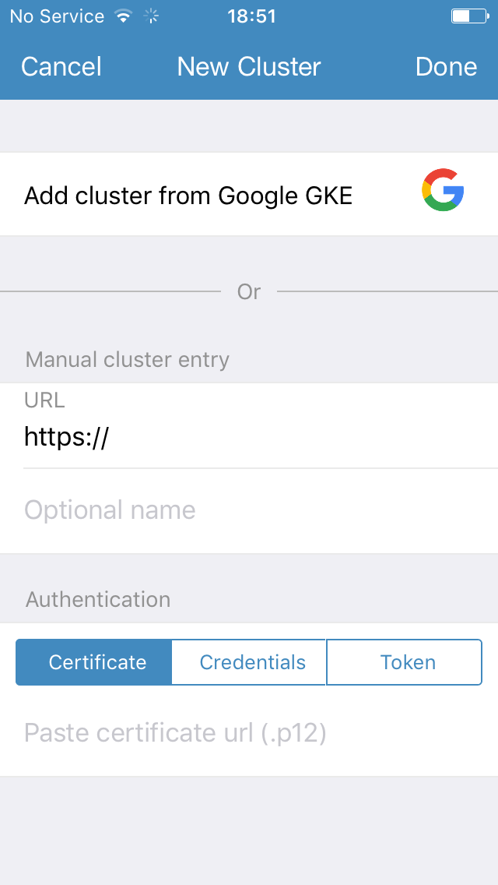
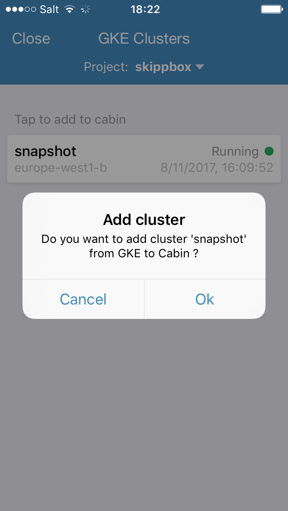
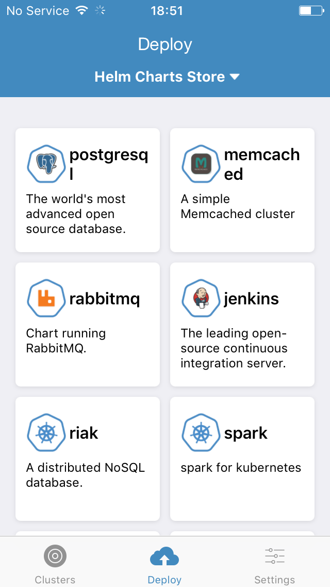
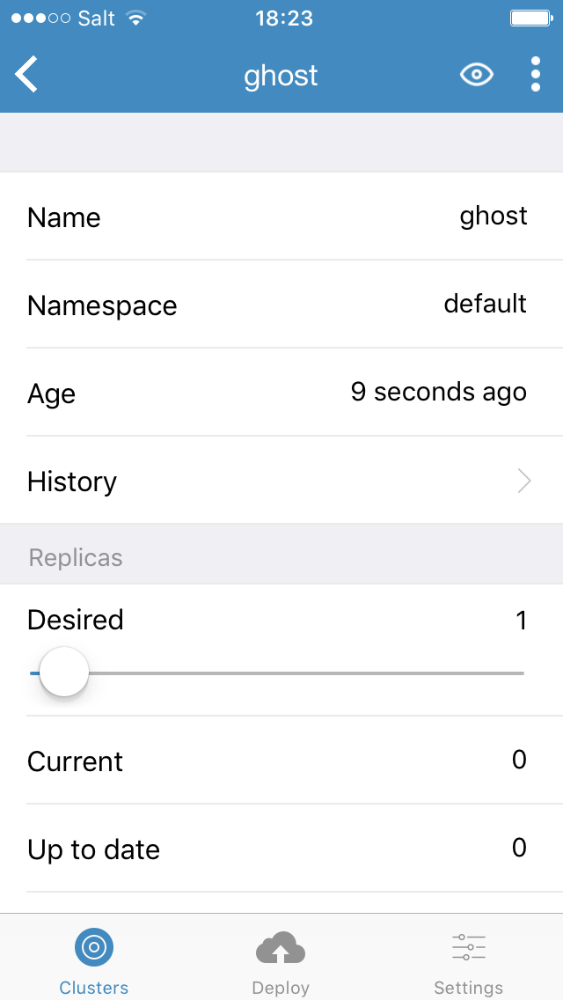
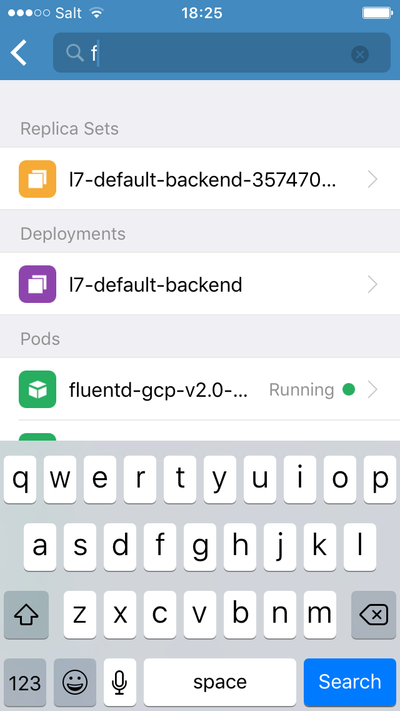
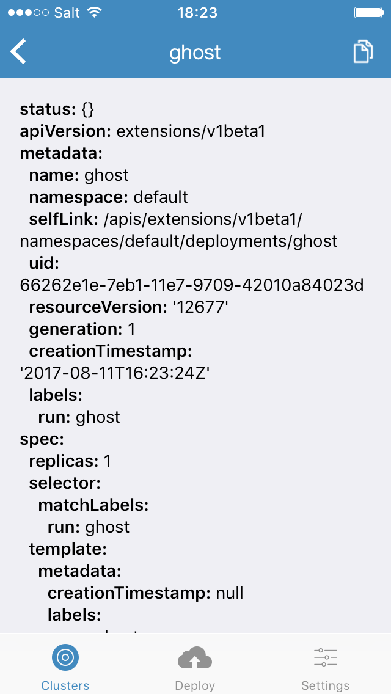
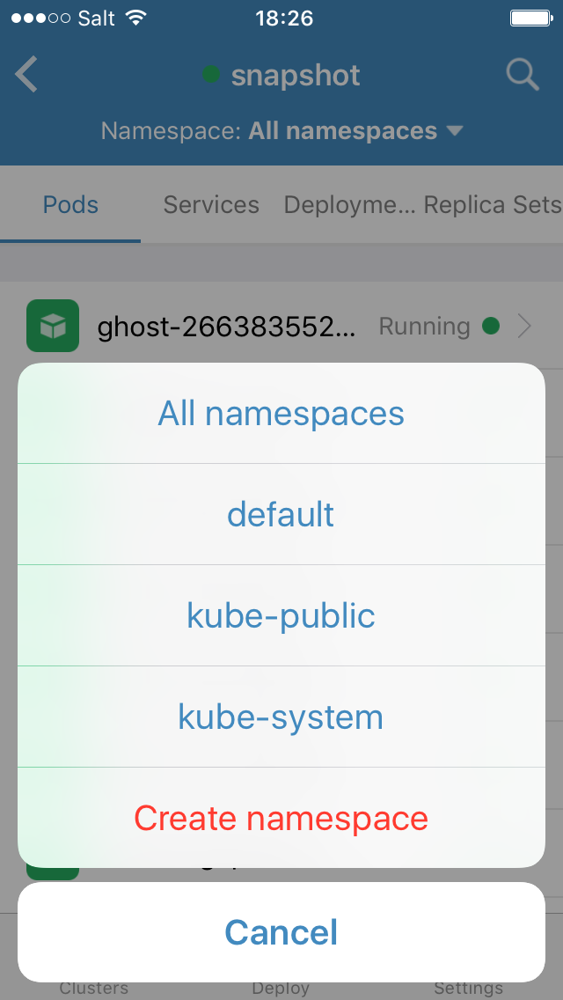
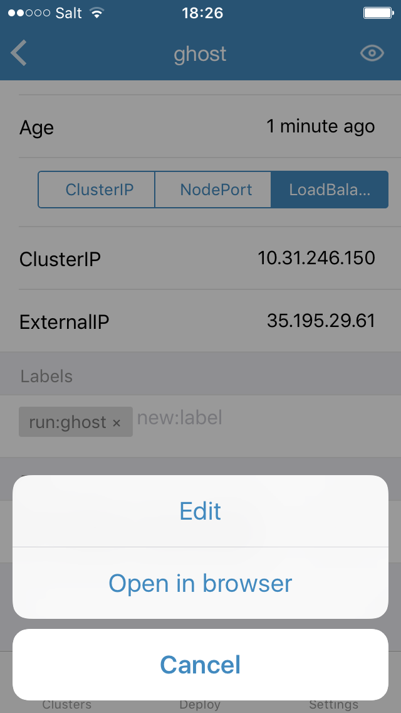

# Cabin, the mobile app for [Kubernetes](https://kubernetes.io)

Cabin is a Mobile application for Kubernetes. It is loaded with features as shown in the [screenshots](##screenshots) and the [screencast](##screencast). It is a mobile native version of the Kubernetes dashboard with intuitive finger actions to manipulate Kubernetes resources. For example you can delete pods with a single left swipe. You can also add, delete labels, scale deployments with a finger scroll, access logs of your pods, run simple exec commands in containers, trigger rolling-updates by changing the image of your deployments, etc...

Currently still in dev is support for Helm charts. You can view Charts repositories and launch charts.

GKE users will enjoy the ability to create clusters directly from their phone and also add pre-existing GKE clusters to the application to view existing resources.

Cabin is made with [React Native](https://facebook.github.io/react-native/). For [development](##run-locally-using-simulators) purposes you can run the application using both iOS and Android simulators.

We would love your help to make it even cooler !

## Screenshots

Click on each picture to enlarge.

<table style="width:100%">
<tr>
  <td>
    <a href="https://raw.githubusercontent.com/bitnami/cabin/master/images/cluster-add.png">
    <p><b>Add Clusters</b></p>
    
    </a>
  </td>
  <td>
    <a href="https://raw.githubusercontent.com/bitnami/cabin/master/images/gke.png">
    <p><b>Create Cluster on GKE</b></p>
    
    </a>
  </td>
  <td>
    <a href="https://raw.githubusercontent.com/bitnami/cabin/master/images/pods.png">
    <p><b>Pods View</b></p>
    
    </a>
  </td>
  <td>
    <a href="https://raw.githubusercontent.com/bitnami/cabin/master/images/charts.png">
    <p><b>Charts View</b></p>
    
    </a>
  </td>
</tr>
<tr>
  <td>
    <a href="https://raw.githubusercontent.com/bitnami/cabin/master/images/deployment-view.png">
    <p><b>Deployment Scaling</b></p>
    
    </a>
  </td>
  <td>
    <a href="https://raw.githubusercontent.com/bitnami/cabin/master/images/logs.png">
    <p><b>Pod Logs</b></p>
    
    </a>
  </td>
  <td>
    <a href="https://raw.githubusercontent.com/bitnami/cabin/master/images/labels.png">
    <p><b>Edit Labels</b></p>
    
    </a>
  </td>
  <td>
    <a href="https://raw.githubusercontent.com/bitnami/cabin/master/images/search.png">
    <p><b>Search by Label</b></p>
    
    </a>
  </td>
</tr>
<tr>
  <td>
    <a href="https://raw.githubusercontent.com/bitnami/cabin/master/images/yaml-view.png">
    <p><b>YAML View</b></p>
    
    </a>
  </td>
  <td>
    <a href="https://raw.githubusercontent.com/bitnami/cabin/master/images/ns.png">
    <p><b>Namespace Chooser</b></p>
    
    </a>
  </td>
  <td>
    <a href="https://raw.githubusercontent.com/bitnami/cabin/master/images/resource-list.png">
    <p><b>Resource Listing Toggle</b></p>
    
    </a>
  </td>
  <td>
    <a href="https://raw.githubusercontent.com/bitnami/cabin/master/images/set-image.png">
    <p><b>Set Image</b></p>
    
    </a>
  </td>
</tr>
<tr>
  <td>
    <a href="https://raw.githubusercontent.com/bitnami/cabin/master/images/services.png">
    <p><b>Service Types</b></p>
    
    </a>
  </td>
  <td>
    <a href="https://raw.githubusercontent.com/bitnami/cabin/master/images/open-browser.png">
    <p><b>Open Service in Browser</b></p>
    
    </a>
  </td>
  <td>
    <a href="https://raw.githubusercontent.com/bitnami/cabin/master/images/ghost.png">
    <p><b>Access Web Apps</b></p>
    
    </a>
  </td>
</tr>
</table>

## Screencast

It is full of neat features, check out the screencast below by clicking on the image:

<p align="center">
<a href="https://www.youtube.com/watch?v=z54uH2gDmso">

</a>
</p>

## Run Locally Using Simulators

Install node dependencies:

```
npm install
```

Install React Native cli:

```
npm install -g react-native-cli
```

Run the packager:

```
npm start
```

### iOS

Install ios dependencies:

```
gem install cocoapods
cd iOS/ && pod install
```

Run the app on iOS for dev:
(you need Xcode installed on your mac)

```
react-native run-ios
```

### Android

The easiest way is to run the app directly from Android Studio (add `cabin/android` as an existing project).

Or you can use `react-native run-android` if you already have an emulator launched or a device connected (to launch one is `path/to/android/sdk/emulator -avd <emulator name>`)

## Get Cabin

Install Cabin for iOS or Android on the application stores:

* [iTunes](https://itunes.apple.com/us/app/cabin-manage-kubernetes-applications/id1137054392?mt=8)
* [Play store](https://play.google.com/store/apps/details?id=com.skippbox.cabin&hl=en)

## Contributing

Check our contributing [guidelines](CONTRIBUTING.md) and send your pull requests.

## Issues

If you face any issues with Cabin, please create an [issue](https://github.com/bitnami/cabin/issues)

**Note** that to preserve as much history as possible we imported a good number of issues from our private repo and the cabin-issues repository.

## Code of Conduct

Cabin abides by the Kubernetes [Code of Conduct](code-of-conduct.md)

## Sponsor

Cabin is brought to you thanks to [Bitnami](https://bitnami.com). Cabin was developed by Skippbox and joined the Bitnami portfolio of Kubernetes products after Skippbox's [acquisition](https://thenewstack.io/skippbox-enterprise-building-kubernetes-bitnami/).

